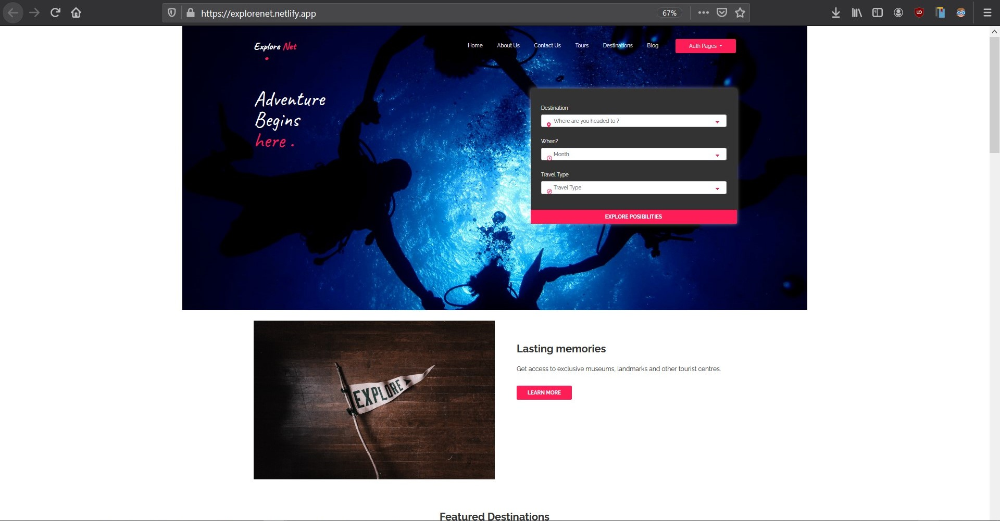

**Collaboration Instructions:**

    1. Clone this repository to your local PC.
    2. Your assets such as images, CSS file, JavaScript file should be placed in the Images, CSS, Javascript folders respectively.
    3. Use 90% botstrap for your styling.
    4. Ensure responsiveness in your designs. **Important** .
    5. Create a new branch locally name it according to the the instruction on the user story
    6. Once you are done working run "git pull" locally.
    7. Push your code to the repository.
    8. Make a Pull request for the master branch. 

## Design
    https://www.figma.com/file/nNibMGE90jLTT0SLKeQjTN/Travel-Website-template?node-id=119%3A2

# Project Envato by Team Fury

## Explorenet 
explorenet is a travel site designed in order to give users an opportunity to live their lives full of adventures such as going to some of the most beautiful locations on the planet.

##  Deployment

The application was deployed to netlify.

##  Built With

*  HTML
*  CSS
*  JavaScript
*  Bootstrap

##  Authors

* **Raphael Ehindero**  (https://github.com/raph941) - Slack Username: **@Ralph**
* **Wendy Munyasi**  (https://github.com/wendymunyasi) - Slack Username: **@__wendy**
* **Arogunjo Babatope E**  (https://github.com/babatee199) - Slack Username: **@babatope**
* **Lucas Gomez**  (https://github.com/gomezlucas) - Slack Username: **@LucasD**
* **David Ozokoye**  (https://github.com/gyrationtechs) - Slack Username: **@ndo**
* **Victoria Alao** - Slack Username: **@Folakemi**
* **Faith Oni** - Slack Username: **@Ayoola**
* **Ikechukwu okonkwo** - Slack Username: **@Iykee**
* **Boluwatife Oyinloye** - Slack Username: **@Orel**
* **Emmanuel Ogunmoroti** - Slack Username: **@Emmbrik**
* **Johnson Adebisi** - Slack Username **@johnson042**
* **Benson Momodu** - Slack Username: **@Benson**

##  License

This project is licensed under the MIT License.

## Project-Setup Instructions.

1. git clone using the following links.

   link: https://github.com/wendymunyasi/travel.git

2. Naviagte to the `travel` directory.
3. Open the file `index.html` to view the app on your browser.

## BDD

| Behaviour | Output |
| --------- | ------ |
|On loading the app you see the landing page showing lasting memories, featured destinations, featured tours, and reviews from satisfied clients.|Not Applicable.|
|Clicking `About Us` link on the navigation bar.|You are redirected to a page where you view our story and team.|
|Clicking `Contact Us` link on the navigation bar.|You are redirected to a page written various ways you can use to contact us.|
|Clicking `Destination` link on the navigation bar.|You are redirected to a page showing our top destinations and you can be able to search for a destination.|
|Clicking `Blog` link on the navigation bar.|You are redirected to a page showing a list of our blogs and clicking any of the blogs takes you to a page showing the details of the blog.|

## Sample Screenshot of a Part of the landing page

    

